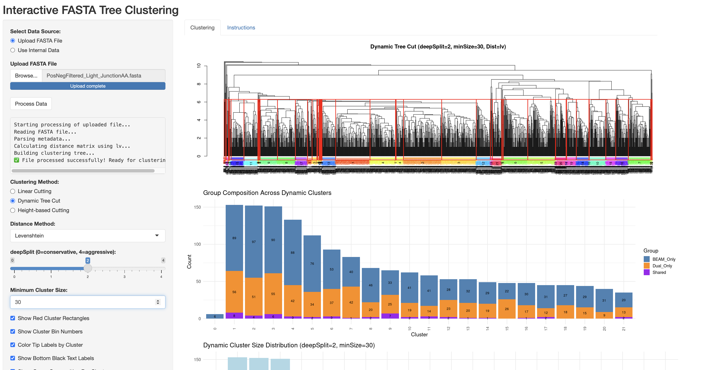

### Figure 5E (Left Panel)

The [**fastaTreeClustering** Shiny app](https://github.com/foocheung/fastaTreeClustering) was used to generate the tree visualization for Figure 5E (left panel). The app performs CDR3 clustering and phylogenetic tree construction based on Levenshtein distance.

**Input file used:**\
`data/PosNegFiltered_Light_JunctionAA.fasta`\
This file contains filtered light chain CDR3 sequences from antigen-positive and antigen-negative sorted fractions.

The image below is a screenshot of the web app interface displaying the generated tree plot. It serves as verification that the figure was produced using this tool.

